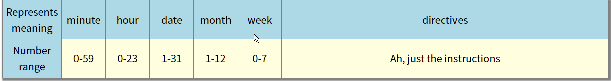
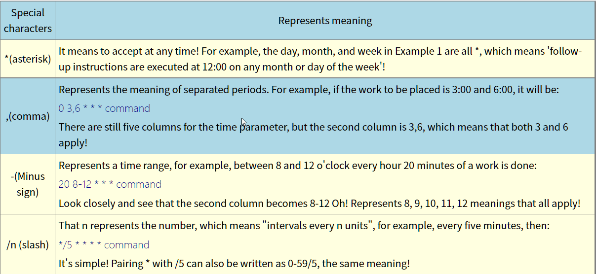

15.1 What is routine work scheduling
15.1.1 Types of Linux Work Schedules: at, crontab
15.1.2 Routine work commonly found on CentOS Linux systems
15.2 A workplan to be implemented only once
15.2.1 How atd is started and at works: /etc/at.deny
15.2.2 Actual operation of single work scheduling: at, atq & atrm, batch
15.3 Routine workplans for cyclic execution
## 15.3.1 User settings: /etc/cron.deny, crontab


15.3.2 System configuration file: /etc/crontab, /etc/cron.d/*
15.3.3 Some Considerations
# 15.4 Wake-up of work tasks during downtime
"abacron" can help you with scheduling that's time to run but isn't executing!
## 15.4.1 What is anacron

```c
for ( "every hour" )
{
    analyze the current time and the time record document recorded by 'anacron';
        if ( "current time" != "time record document recorded by 'anacron' " )
            if ( "there is more than a deadline of work" )
                perform the schedule task;
            else
                break;//stop
}
```
## 15.4.2 anacron vs /etc/anacrontab
