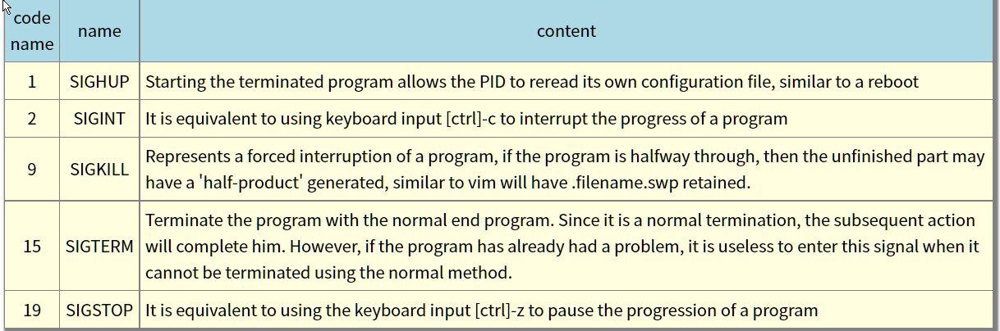
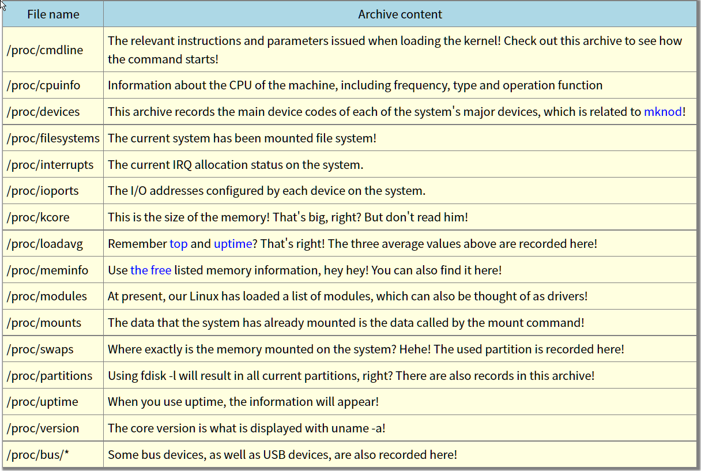
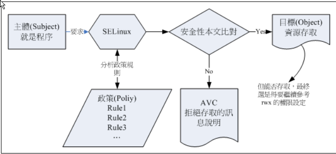
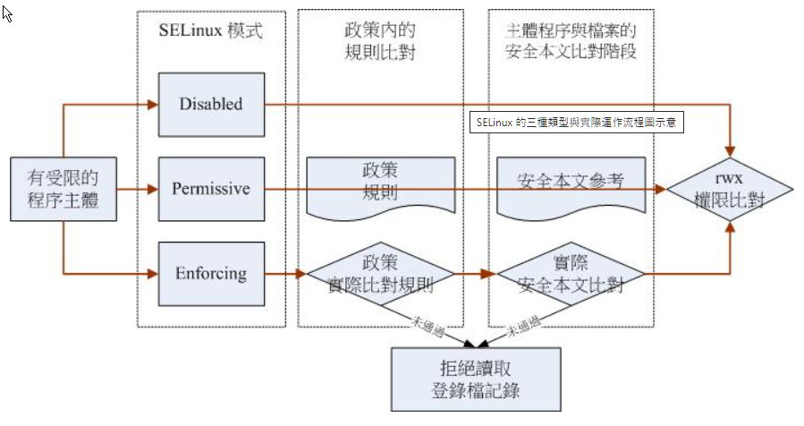

16.1 What is a program (process)

## 16.1.1 Program & Program: subroutine and parent program, fork-And-EXEC, system service

16.1.2 LINUX multiplayer environment

16.2 work management (job control)

16.2.1 What is work management

16.2.2 jobs of job control: &, [ctrl] -z, jobs, fg, bg, kill

16.2.3 offline management issues: noHUP

16.3 Program Management

16.3.1 Program Observation: PS (PS -L, PS AUX, Zombie), TOP, PSTREE

## 16.3.2 Program management: Signal, Kill, KILLALL

16.3.3 About the order of programs: Priority, Nice, Renice

16.3.4 Observation of System Resources: Free, Uname, Uptime, NetStat, DMESG, VMSTAT

16.4 Special archives and procedures

16.4.1 The instruction execution status with SUID/SGID permissions

## 16.2 /proc /* represents the meaning of  

16.4.3 Inquiry Files that have been opened or executed by the execution program: FUSER, LSOF, PIDOF

16.5 SELINUX preliminary visit

16.5.1 What is Selinux: target, DAC, MAC

## 16.5.2 Selinux operating mode: component, security This article, domain/type  

16.5.3 Starting, closing and observation of the three modes of Selinux: Getenfo1rce, SeStatus, startup and closing, setenforce

## 16.5.4 Rule Management in the SELINUX policy: Getsebook, Seinfo, Sesearch, Setsebook

16.5.5 Selinux Safety of this article: CHCON, RESTORECON, SEMANAGE

## 16.5.6 A network service case and login file assistance: the required service, FTP instance, anonymous example, general user home directory, informal directory, informal Port
Fix "access denied 530"