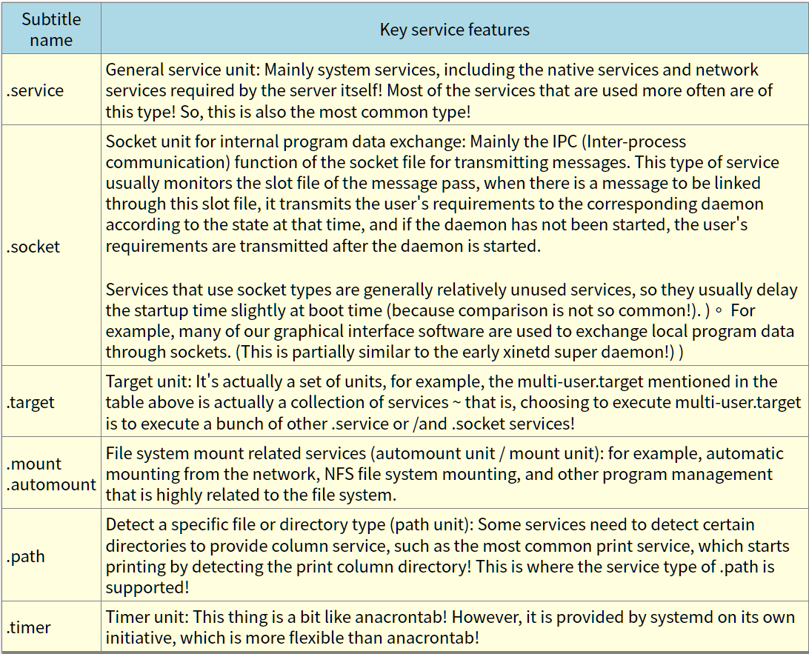

# 17.1 What is daemon and services
## 17.1.1 The main classification of daemon in the init management behavior of early Systemp V
## 17.1.2 Unit classification used by systemd
program -> process -> service -> daemon  


## 17.2 Managing Services through Systemctl
## 17.2.1 Manage the startup/boot and observation status of a single service unit through systemctl
```bash
[root@localhost ~] ll /etc/systemd/system/multi-user.target.wants/chronyd.service 
lrwxrwxrwx. 1 root root 39 Jul 23 20:57 /etc/systemd/system/multi-user.target.wants/chronyd.service -> /usr/lib/systemd/system/chronyd.service
[root@localhost ~] systemctl disable chronyd.service 
Removed symlink /etc/systemd/system/multi-user.target.wants/chronyd.service.
# systemctl disable service == rm corresponding linked file of the service
[root@localhost ~] systemctl enable chronyd.service 
Created symlink from /etc/systemd/system/multi-user.target.wants/chronyd.service to /usr/lib/systemd/system/chronyd.service.
[root@localhost ~] ll /etc/systemd/system/multi-user.target.wants/chronyd.service 
ls: cannot access /etc/systemd/system/multi-user.target.wants/chronyd.service: No such file or directory
# systemctl enable service == touch corresponding linked file of the service
```
17.2.2 Observe all services on the System through systemctl
17.2.3 Managing Different Operating Environments (Target Units) through Systemctl
17.2.4 Analyze dependencies between services through systemctl
17.2.5 Introduction to directories related to the daemon operation of systemd: /etc/services
17.2.6 Shutting Down Network Services
17.3 systemctl Is the settings file for the type of service
17.3.1 Introduction to the directories associated with the systemctl settings file
17.3.2 Introduction to the setup project of the systemctl settings file
17.3.3 Two instances of vsftpd operation
17.3.4 Multiple Repetitions: Getty as an example
17.3.5 Do your own services yourself
17.4 Systemctl Configuration file for timers
17.5 Simple description of the services that are started by default in CentOS 7.x