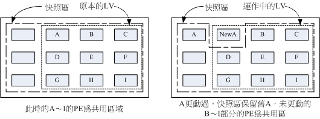
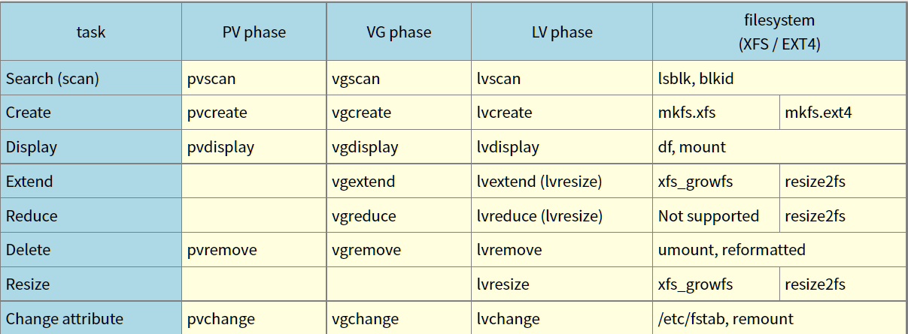

# Chapter 14: Quotas and Advanced File System Management
14.1 Application and Implementation of Quotas  
14.1.1 What is Quota: General Purpose, Restriction, Specification (inode/block, soft/hard, grace time).  
14.1.2 An example of a quota for an XFS file system  
14.1.3 Implement quota process-1: support and   observation of archival systems (/etc/fstab, /etc/mtab).  
14.1.4 Implementing quota process-2: Observe quota report data (xfs_quota, print, df, report, state)  
14.1.5 Implementing Quota Process-3: Limit Setting (limit, grace_time)  
## 14.1.6 Implementing quota flow-4: project restrictions (for directory restrictions) (Optional)

It's just that this project can't be set at the same time as the group!   

&nbsp;&nbsp;&nbsp;&nbsp;/dev/mapper/centos-home /home xfs  defaults,usrquota,~~grpquota~~,prjquota  0 0   

## 14.1.7 XFS Quota Management and Additional Directives Comparison Table
14.1.8 Do not alter quota instances of existing systems
14.2 Software RAID
14.2.1 What is RAID: RAID-0, RAID-1, RAID1+0, RAID-5, Spare disk
## 14.2.2 software, hardware RAID
    "partprobe" inform the OS of partition table changes
### Build a RAID in mdadm
```bash
    mdadm --create /dev/md0 --auto=yes --level=5 --chunk=256K \
    > --raid-devices=4 --spare-devices=1 /dev/vda{5,6,7,8,9}
# --create == create a new array
# --auto=yes
# "yes" requires the named 'md' device(/dev/md0) to have a 'standard' format, and the type and minor number will be determined from this.

```
14.2.3 Settings for software disk arrays: mdadm --create
14.2.4 Rescue mode simulating RAID error: mdadm --manage
14.2.5 Booting the RAID automatically and mounting it automatically
14.2.6 Shutting Down Software RAID (Important!) )
14.3 Logical Volume Manager
## 14.3.1 What is LVM: The Meaning of PV, PE, VG, LV

14.3.2 LVM Implementation Flow: PV Phase, VG Phase, LV Phase, File System Phase
14.3.3 Amplified LV capacity: xfs_growfs
## 14.3.4 Use LVM thin Volume to have LVM dynamically adjust disk usage automatically Disk Snapshots for 14.3.5 LVM: Take a traditional snapshot and restore it as a snapshot for use in a test environment

## 14.3.6 LVM-related instruction sinks and LVM shutdowns

14.4 Highlights
14.5 Exercises in this Chapter
14.6 References and Further Reading
Recommendation for this article: http://phorum.vbird.org/viewtopic.php?t=23888